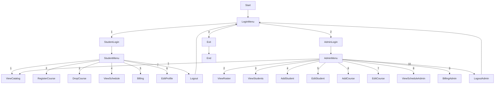

# unknownapp
This is an unknown application written in Java

---- For Submission (you must fill in the information below) ----
### Use Case Diagram

### Flowchart of the main workflow

### Prompts
Convert a Java course registration function into Python, including enroll and drop course logic.

Write a simple Python CLI program that allows a student to:
- view courses
- register for a course
- drop a course

Ensure the program includes:
- capacity checking
- prevention of duplicate enrollment
- simple menu interaction
